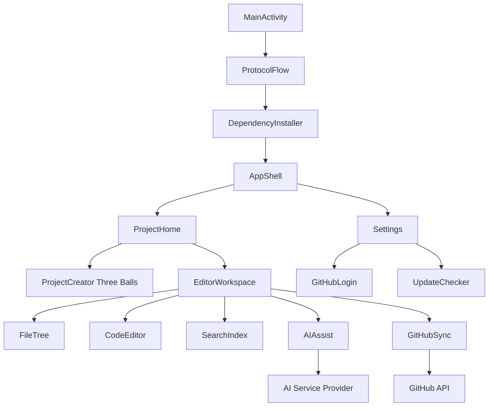

# Android Dev Toolkit 2.0

Feature Name: android-dev-toolkit-2.0
Updated: 2026-08-14

## Description

Complete rewrite of FloatAI into Android IDE with C++ editor homepage, GitHub integration, remote project sync, AI assisted coding, and guided onboarding with protocol and dependency installer.

## Architecture

## Components and Interfaces

### ProtocolFlow
- Shows usage agreement checkboxes
- On accept, triggers DependencyInstaller
- Persists acceptance version

### DependencyInstaller
- One-click download of Android SDK/NDK/CMake/Gradle
- Uses background service with progress UI
- Validates installation before proceeding

### AppShell
- Drawer navigation with 项目 / 设置
- Top bar with hamburger menu
- Retains three-line menu icon

### ProjectHome
- Three balls UI for folder/service/dependency step
- Project list with create/open/build/delete
- Project creation form: Android API, language selection

### EditorWorkspace
- File tree view
- C++ / Kotlin / Java editor with syntax highlight
- Toolbar with 4 actions: 文件, 搜索, AI, 同步

### GitHubSync
- OAuth login flow
- Remote download project
- Push/pull with token stored in Settings
- Auto build trigger after sync

### AIAssist
- Configurable OpenAI compatible provider
- Code copy and question interface
- API key stored encrypted

### BuildPublisher
- Right side build button
- Options: test install / publish version
- Version input and release notes
- Auto localization step after build

## Data Models

- Project: id, name, path, apiLevel, language, gitRepoUrl
- Dependency: name, version, installed, path
- GitHubAccount: username, token, avatar
- AIConfig: providerUrl, apiKey, model

## Correctness Properties

- Protocol must be accepted before home access
- Dependencies must be verified before project creation
- GitHub token must be valid before sync
- Build action requires project opened

## Error Handling

- Dependency download failure shows retry
- GitHub auth failure prompts re-login
- Build failure shows log output
- AI provider error shows fallback message

## Test Strategy

- Unit tests for project creation logic
- Integration tests for GitHub OAuth flow
- UI tests for drawer navigation and three balls
- Manual test for dependency installer on clean device

## References

[^1]: Requirements document - requirements.md
