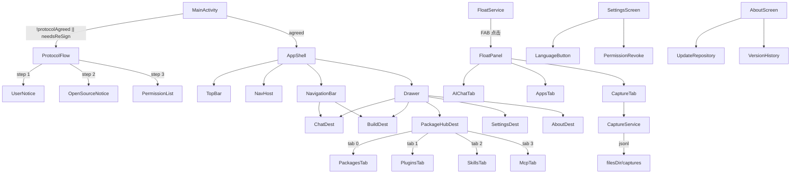

# Design — v1.0.3 FloatAI Package Hub

Feature Name: v1-0-3-package-hub
Updated: 2026-08-12

## Description

v1.0.3 重构主导航、删除 ATK、整合 Package Hub（包管理 / 插件 / 技能 / MCP 四 Tab）、语言选择挪到设置、协议页引入权限逐项声明与开源协议、关于页引入「检查更新」与版本历史、悬浮窗面板加抓包 Tab。

## Architecture



## Components and Interfaces

### 新增组件

| 组件 | 路径 | 作用 |
|------|------|------|
| `ui/screens/packagehub/PackageHubScreen.kt` | 主容器 | 4 Tab 切换 |
| `ui/screens/packagehub/PackagesTab.kt` | 包 Tab | 复用 v1.0.2 PackageRegistry |
| `ui/screens/packagehub/PluginsTab.kt` | 插件 Tab | 占位（v1.0.4 实现） |
| `ui/screens/packagehub/SkillsTab.kt` | 技能 Tab | 占位（v1.0.4 实现） |
| `ui/screens/packagehub/McpTab.kt` | MCP Tab | 复用 v1.0.2 McpScreen |
| `ui/screens/about/AboutScreen.kt` | 关于页 | 版本信息 + 检查更新 |
| `capture/CaptureService.kt` | VpnService 子类 | 抓包流量 |
| `capture/CaptureRepository.kt` | 抓包数据持久化 | jsonl 写入 / 读取 |
| `ui/screens/build/ProjectCreateDialog.kt` | 项目创建表单 | 模态弹窗 |
| `service/FloatService.kt` | 重写 | 多 Tab 面板 |

### 删除组件

- `ui/flow/LanguageFlow.kt`
- `ui/screens/atk/AtkScreen.kt`
- `ui/screens/mcp/McpScreen.kt`（移入 Hub）
- `i18n/strings.xml` 中 `nav_atk`、`nav_mcp`

### 修改组件

- `MainActivity.kt`：移除 LanguageFlow 分支
- `ui/shell/AppShell.kt`：bottomBar 改为 [CHAT, BUILD]；drawer 增加 ABOUT；移除 ATK/MCP
- `ui/flow/ProtocolFlow.kt`：从 2 步改为 3 步（加入开源协议 + 权限）
- `ui/screens/settings/SettingsScreen.kt`：语言按钮 + 权限撤销 + 检查更新移除
- `service/FloatService.kt`：面板 Tab 增加到 3 个（AI / Apps / Capture）
- `data/UpdateRepository.kt`：暴露 `loadRecentReleases(n)` API

## Data Models

```kotlin
data class PackageTab(val id: String, val title: String, val icon: String)

data class CaptureRecord(
    val id: String,              // UUID
    val sessionId: String,
    val timestamp: Long,
    val sourceApp: String,       // 应用包名（来自 sock.getApplicationOwner 等价方法）
    val srcHost: String,
    val srcPort: Int,
    val dstHost: String,
    val dstPort: Int,
    val method: String,
    val url: String,
    val requestBody: String,
    val responseStatus: Int,
    val responseBody: String
)

data class ProjectTemplate(
    val id: String,
    val name: String,
    val minSdk: Int,
    val targetSdk: Int,
    val compose: Boolean
)

data class AppPermission(
    val key: String,             // "overlay" | "notifications" | "microphone" | ...
    val displayName: String,
    val grantType: GrantType     // RUNTIME | SPECIAL
)
enum class GrantType { RUNTIME, SPECIAL }

data class ReleaseNote(
    val tag: String,
    val publishedAt: Long,
    val summary: String,
    val downloadUrl: String?
)
```

## Correctness Properties

1. **协议签署原子性**：PROTOCOL_VERSION 与本地存储同时更新；任意一方失败时不进入主界面
2. **权限撤销幂等**：重复撤销同一权限不抛异常
3. **抓包 sessionId 唯一**：每次启动 VpnService 生成新 UUID
4. **悬浮窗 4 Tab 切换无状态泄漏**：当前 Tab 切换不丢失各 Tab 的 StateFlow 订阅
5. **关于页拉取更新失败时**：UI 显示「无法连接到 GitHub」而不崩溃

## Error Handling

| 场景 | 处理 |
|------|------|
| VpnService 权限被拒 | 提示「抓包需要在系统弹窗中授予 VPN 权限」 |
| 抓包数据写盘失败 | 跳过本条 + Toast「磁盘已满」 |
| GitHub 更新 API 失败 | 显示「无法连接」并保留「手动查看」链接 |
| 撤销特殊权限（悬浮窗）失败 | 跳转系统设置并提示手动关闭 |
| SharedPreferences 损坏 | 捕获异常并使用默认值 |

## Test Strategy

- 单测：`CaptureRecord.fromJsonLine` / `ReleaseNote.fromJson` 解析往返
- UI 编译验证：`./gradlew assembleRelease`
- 协议签署验证：手动清 prefs → 启动 App → 应进入新协议页
- 抓包验证：开 VPN → 访问 baidu.com → 检查 filesDir/captures/*.jsonl
- 权限撤销验证：撤销麦克风权限 → 系统设置中消失

## Implementation Order (v1.0.3 单版本完成)

1. 删除 AtkScreen / LanguageFlow，AppShell 调整为 2-Tab + Drawer
2. 新建 AboutScreen + ProjectCreateDialog + PackageHubScreen（4 Tab）
3. 重写 ProtocolFlow 为 3 步 + PROTOCOL_VERSION=4
4. SettingsScreen 改造：语言按钮、权限撤销、移除旧检查更新
5. 新建 CaptureService + CaptureRepository + FloatService 加 Capture Tab
6. 字符串 i18n 同步（新增 nav_about、nav_capture 等）
7. 编译 + 签名 + 发布 v1.0.3
