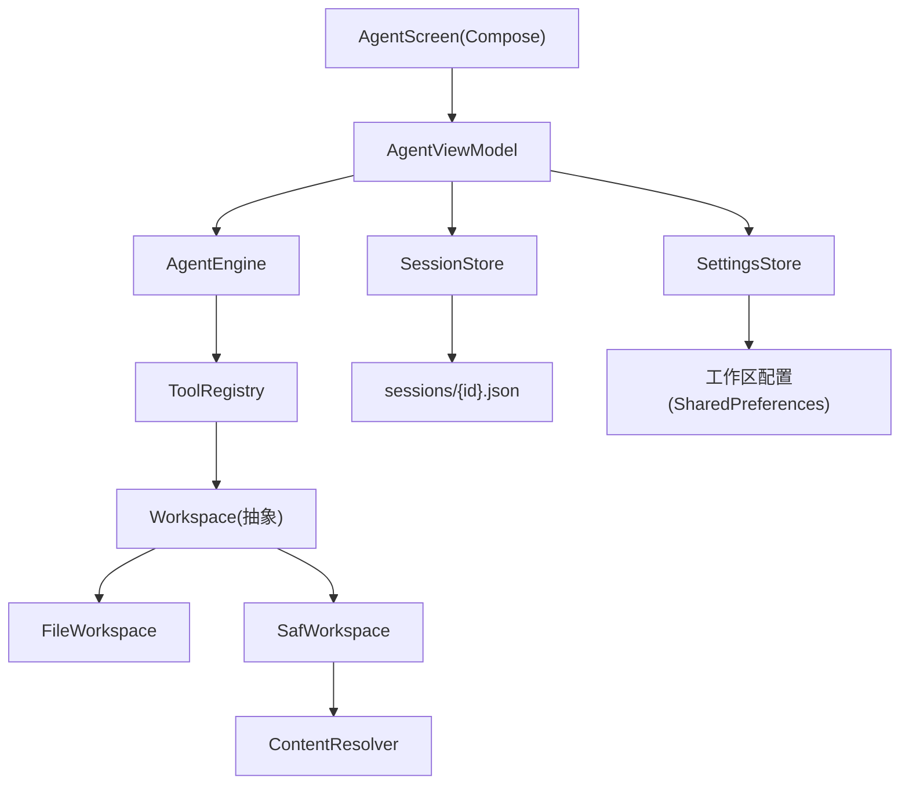

# v1.0.8 BSK AI Agent 编码能力完善

Feature Name: v1-0-8-agent-coding
Updated: 2026-08-24

## Description

本版本围绕 AI 编码智能体做三块增强：

1. 修复 AgentEngine 多工具调用（multi-tool-call）缺陷：一轮推理返回多个 `tool_call` 时，assistant 消息历史仅保留第一条，其余工具调用及结果在后续推理中丢失，导致 Agent 上下文不完整。
2. 会话持久化：Agent 对话（用户 / assistant / 工具调用与结果）实时落盘，重启可恢复，支持多会话列表、新建、删除，历史仅作上下文参考、不重放工具。
3. 可切换工作区：Agent 文件类工具的相对根目录支持切换到任意目录（通过 SAF `ACTION_OPEN_DOCUMENT_TREE`），并持久化选择。

## Architecture



### 关键改动点

- `AgentMessage` 增加 `toolCalls: List<ToolCallData>`，`toWire()` 输出完整 `tool_calls` 数组；`ToolCallData` 从 `AgentEngine` 提升为顶层类型，避免循环依赖。
- `AgentEngine.run()` 将整轮 `toolCalls` 写入 assistant 消息，并逐个执行、按 `tool_call_id` 写入 tool 结果。
- 新增 `SessionStore`（会话持久化）与 `Workspace` 抽象（文件 / SAF 双实现），工具层从依赖 `workspaceRoot: String` 改为依赖 `Workspace`。
- 工作区选择持久化到 `SettingsStore`，SAF 授权通过 `takePersistableUriPermission` 持久化。

## Components and Interfaces

### AgentMessage（修改）

```kotlin
data class ToolCallData(
    val id: String,
    val name: String,
    val args: JSONObject
)

data class AgentMessage(
    val role: String,
    val content: String = "",
    val toolCallId: String? = null,
    val toolName: String? = null,
    val toolArgs: JSONObject? = null,
    val toolCalls: List<ToolCallData> = emptyList()
) {
    fun toWire(): JSONObject        // 多 toolCalls 时输出完整数组
    fun toJson(): JSONObject        // 会话持久化序列化
    companion object {
        fun fromJson(obj: JSONObject): AgentMessage   // 反序列化，兼容旧单调用格式
    }
}
```

- 保留 `toolName/toolCallId/toolArgs` 字段用于兼容旧数据与 UI 单调用展示。
- `toWire()` 优先输出 `toolCalls`；为空时回退旧逻辑。

### AgentEngine（修改）

- 删除内部 `ToolCallData`，引用顶层类型。
- `run()` 中 assistant 消息改为：

```kotlin
messages.add(
    AgentMessage(role = "assistant", content = content, toolCalls = toolCalls)
)
for (call in toolCalls) {
    // 未知工具 / 权限拒绝 / 执行结果均按 call.id 写入 tool 消息
    messages.add(AgentMessage("tool", result.output, toolCallId = call.id))
}
```

### Workspace 抽象（新增 `agent/Workspace.kt`）

```kotlin
data class WorkspaceEntry(val name: String, val isDirectory: Boolean, val size: Long)

sealed class Workspace {
    abstract val displayName: String
    abstract val supportsRealPath: Boolean          // SAF 下为 false
    abstract suspend fun exists(rel: String): Boolean
    abstract suspend fun isDirectory(rel: String): Boolean
    abstract suspend fun readText(rel: String): String
    abstract suspend fun writeText(rel: String, content: String)
    abstract suspend fun list(rel: String): List<WorkspaceEntry>
    abstract fun realPathFor(rel: String): String?  // 仅 FileWorkspace 返回真实路径
}

class FileWorkspace(val root: File) : Workspace()
class SafWorkspace(private val context: Context, private val treeUri: Uri) : Workspace()
```

- 相对路径解析统一以工作区根为基准，`rel` 为相对路径（如 `app/build.gradle`）。
- `SafWorkspace` 基于 `DocumentFile.fromTreeUri` + `ContentResolver`，`rel` 为空表示根目录。

### ToolContext（修改）

```kotlin
class ToolContext(
    val app: Context,
    val workspace: Workspace
) {
    suspend fun readText(rel: String): String = workspace.readText(rel)
    // ... 透传 workspace 能力
}
```

- 移除 `resolveWorkspace(path): String`（被 FileWorkspace.realPathFor 替代）。

### 工具改造

| 工具 | 改动 |
|------|------|
| read_file | 用 `workspace.readText`，支持 offset/maxLines 分行逻辑 |
| write_file | 用 `workspace.writeText` |
| edit_file | 用 `workspace.readText/writeText` 做精确替换 |
| list_dir | 用 `workspace.list` |
| shell | 仅 `workspace.supportsRealPath` 时可用，否则返回错误提示 |
| new_project | 仅 `workspace.supportsRealPath` 时可用；`ProjectScaffold.create` 增加 root 参数 |
| build_project | 仅 `workspace.supportsRealPath` 时可用 |
| get_system_info / list_models / download_model | 不依赖工作区，不变 |

### SessionStore（新增 `core/session/SessionStore.kt`）

```kotlin
data class SessionMeta(val id: String, val title: String, val updatedAt: Long)

data class Session(
    val id: String,
    val title: String,
    val createdAt: Long,
    val updatedAt: Long,
    val messages: List<AgentMessage>
)

class SessionStore(context: Context) {
    fun list(): List<SessionMeta>                 // 按 updatedAt 倒序
    fun load(id: String): Session?
    fun save(session: Session)
    fun delete(id: String)
    fun defaultDir(): File                        // filesDir/sessions
}
```

- 每个会话一个 JSON 文件 `filesDir/sessions/{id}.json`。
- `id` 取 `System.currentTimeMillis()` + 随机后缀。
- 消息不设条数上限，完整持久化。

### SettingsStore（扩展）

新增工作区配置字段：

```kotlin
data class AgentWorkspaceConfig(
    val mode: WorkspaceMode,      // DEFAULT / FILE / SAF
    val path: String,             // FILE 模式的文件路径
    val treeUri: String           // SAF 模式的 content:// URI
)
enum class WorkspaceMode { DEFAULT, FILE, SAF }
```

- 存 SharedPreferences：`agent_ws_mode`、`agent_ws_path`、`agent_ws_uri`。
- `SettingsStore` 增加对应读写方法与 `StateFlow`。

### AgentViewModel（修改）

- 新增 `sessions: StateFlow<List<SessionMeta>>`、`currentWorkspace: StateFlow<Workspace>`、`currentTitle`。
- `send()`：为当前会话创建/复用 id，每条新消息实时 `sessionStore.save()`。
- `loadSession(id)`：读取会话，清空 `items` 并回填历史条目（工具调用标记为历史，不重放），设为当前会话。
- `newSession()`：清空当前上下文，创建新会话 id。
- `deleteSession(id)`：删除文件并刷新列表。
- `switchWorkspace()`：由 UI 层调用 SAF 选择器后回调；`WorkspaceFactory` 依据配置构造 `FileWorkspace` 或 `SafWorkspace`。

### AgentScreen / MainActivity（修改）

- `AgentHeader` 增加会话菜单（列表 / 新建 / 删除）与工作区入口。
- 新增 `SessionPickerDialog`（会话列表）与 `WorkspaceDialog`（显示当前工作区，切换 / 重置）。
- `MainActivity` 注册 `rememberLauncherForActivityResult(OpenDocumentTree())`，选择后 `takePersistableUriPermission` 并写入 SettingsStore。

## Data Models

### 会话文件 JSON 结构

```json
{
  "id": "1750000000000_ab12",
  "title": "帮我创建一个计算器项目",
  "createdAt": 1750000000000,
  "updatedAt": 1750000000123,
  "messages": [
    {
      "role": "user",
      "content": "帮我创建一个计算器项目"
    },
    {
      "role": "assistant",
      "content": "好的，我先查看工作区结构。",
      "toolCalls": [
        { "id": "call_1", "name": "list_dir", "args": { "path": "" } }
      ]
    },
    {
      "role": "tool",
      "toolCallId": "call_1",
      "content": "目录: ..."
    }
  ]
}
```

### AgentMessage 序列化规则

| role | 字段 |
|------|------|
| user / assistant（无工具） | role + content |
| assistant（含工具） | role + content + toolCalls[] |
| tool | role + toolCallId + content |
| 旧格式兼容 | 读取 toolName / toolArgs 并转换为单元素 toolCalls |

## Correctness Properties

1. 一轮 `N` 个 tool_call，`toWire()` 输出数组长度为 `N`，且每个元素含独立 `id`。
2. 每个 tool 结果消息的 `tool_call_id` 与对应调用的 `id` 完全一致（可被服务端正确关联）。
3. 会话恢复后，`messages` 与持久化前完全一致（round-trip 无损）。
4. 切换工作区不丢失当前会话上下文与历史。
5. SAF 工作区下，`read/write/edit/list` 正常；`shell/new_project/build_project` 返回可读错误，不崩溃。
6. 工作区配置与 SAF 授权在进程重启后仍有效（`takePersistableUriPermission`）。

## Error Handling

| 场景 | 处理 |
|------|------|
| 单个 tool_call 工具名未知 | 写入 `未知工具: name` 到对应 tool 消息，继续执行其余工具 |
| 用户拒绝某个工具权限 | 写入拒绝消息到对应 tool 消息，继续执行其余工具 |
| 工具执行抛异常 | `ToolRegistry.runTool` 捕获并返回 `工具异常: msg` |
| SAF 授权丢失（用户撤销） | 切换工作区按钮触发重新选择；读写返回错误时提示重新授权 |
| 会话文件损坏（JSON 解析失败） | `load()` 返回 null，列表项标记为不可用，允许删除 |
| SAF 工作区下调用 shell 类工具 | 返回错误：`当前工作区为外部目录，shell/项目构建需要切换到应用私有目录` |

## Test Strategy

- 构建期单元级验证通过 Gradle `assembleDebug`（无外部 LLM 依赖）。
- 手动验证路径（无测试框架时按此清单回归）：
  1. 多工具调用：发送任务触发一轮 ≥2 个工具调用，观察后续推理能引用全部工具结果（可在 shell 中 curl 固定 payload 模拟）。
  2. 会话持久化：发送若干消息后杀进程重启，会话列表出现该会话，加载后继续对话正常。
  3. 历史不重放：恢复会话后不再弹出历史工具的权限确认，也不重复执行。
  4. 工作区切换：选择外部目录（SAF）后 read/list 正常、shell 报错；切回默认目录后 shell 恢复。
  5. 重启后 SAF 授权仍有效。

## References

- 现有实现：`AgentEngine.kt`、`AgentMessage.kt`、`ToolRegistry.kt`、`FileTools.kt`、`ShellTool.kt`、`ProjectTools.kt`（`app/src/main/java/com/bskai/agent/`）
- 现有 UI：`AgentScreen.kt`、`AgentViewModel.kt`（`app/src/main/java/com/bskai/ui/screens/agent/`）
- 现有存储模式：`SettingsStore.kt`、`AppSettings.kt`（`app/src/main/java/com/bskai/core/settings/`）
